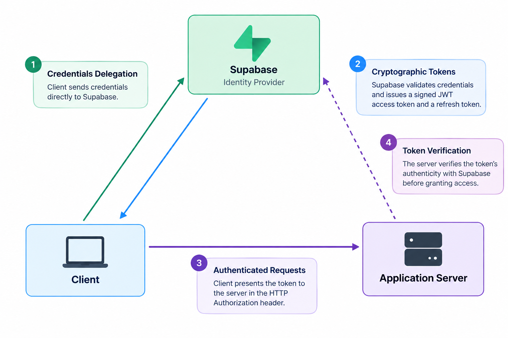

# Authentication and Authorization API

A RESTful Authentication API built with Node.js and Express, using **Supabase Auth** as the external Identity Provider. The system implements stateless JSON Web Token verification, reusable middleware guards, role-based authorization, rate limiting, and interactive OpenAPI/Swagger UI documentation.

## The Trust Triangle



## API Reference

All requests and responses use `application/json` format.

| Endpoint               | Method |     Auth Required     |        Status Codes        | Description                                                                                          |
| :--------------------- | :----: | :-------------------: | :------------------------: | :--------------------------------------------------------------------------------------------------- |
| `/public/info`         | `GET`  |         None          |           `200`            | Open informational route accessible without credentials.                                             |
| `/auth/signup`         | `POST` |         None          |        `201`, `400`        | Registers a new user with `email` and `password`.                                                    |
| `/auth/login`          | `POST` |         None          | `200`, `400`, `401`, `429` | Authenticates credentials and returns JWT access and refresh tokens, protected by rate limiting.     |
| `/auth/refresh`        | `POST` |         None          |    `200`, `400`, `401`     | Uses a valid refresh token to issue a new access token.                                              |
| `/auth/logout`         | `POST` |     Bearer Token      |        `204`, `401`        | Signs out the authenticated user session.                                                            |
| `/protected/profile`   | `GET`  |     Bearer Token      |        `200`, `401`        | Returns safe user profile metadata.                                                                  |
| `/protected/dashboard` | `GET`  |     Bearer Token      |        `200`, `401`        | Demonstrates another protected route using the same middleware guard.                                |
| `/protected/admin`     | `GET`  | Bearer Token and Role |    `200`, `401`, `403`     | Demonstrates role-based access control and is available only to users with administrator privileges. |

## Token Lifecycles

- **Access Tokens (JWT)**:

  Short-lived credentials, typically valid for one hour, are sent with each authenticated request. Their limited lifespan reduces the period of exposure if a token is intercepted.

- **Refresh Tokens**:

  Long-lived, single-use credentials securely stored by the client. When an access token expires, the client calls `POST /auth/refresh` with the refresh token to obtain a new access token without requiring the user to re-enter their password.

### Brute-Force Rate Limiting

The `POST /auth/login` endpoint is guarded by rate-limiting middleware. It restricts each IP address to **5 attempts per 15 minutes**, returning HTTP `429 Too Many Requests` when exceeded. This defends against automated dictionary attacks and password guessing.


## Running the Server

Start the server using npm:

```bash
npm start
```

```
npm run dev
```

Upon successful launch, the console displays:

```text
Server running on port 3000 and connected to Supabase
```

## Swagger UI Interactive Documentation

Interactive documentation is served at:

```
http://localhost:3000/docs
```
